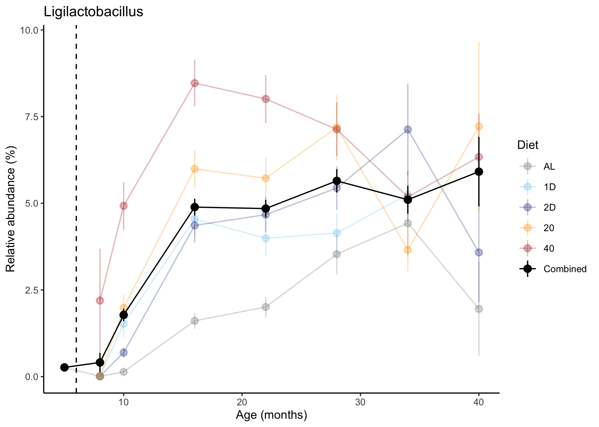

Analysis of taxonomic data from DRiDO microbiome study
================

*Author:* Lev Litichevskiy<br> *Date:* October 28, 2024

In this tutorial, we import taxonomic classification results and perform
several basic analyses:

1.  ɑ-diversity: influence of age and dietary restriction (DR)
2.  Uniqueness: influence of age and DR
3.  PCoA plot
4.  Examples of microbes affected by age and DR

N.B. This tutorial is derived from `kraken.Rmd`.

# Load libraries

``` r
library(tidyverse)
library(phyloseq)
library(speedyseq) # faster tax_glom
library(ggpubr) # for t-test

diet.palette.w.combined <- c(
  Combined="black",
  AL="seashell4",
  `1D`="skyblue",
  `2D`="royalblue4",
  `20`="orange",
  `40`="firebrick")
```

# Import Kraken data

This data has been aggregated by `stool.ID`, meaning that we aggregated
samples originating from the same stool sample. We aggregated by summing
Kraken counts.

``` r
agg.kraken.df <- read.table(
  "../data/kraken_matrix_agg_by_stool_ID_n1303x2997.txt", 
  sep="\t", header=T, row.names=1)
dim(agg.kraken.df)
```

    ## [1] 1303 2997

1303 taxons x 2997 stool IDs

``` r
agg.kraken.df[1:5, 1:4]
```

    ##   DO_1D_3001_038w DO_1D_3001_044w DO_1D_3001_069w DO_1D_3001_097w
    ## 3           38776           86250            7128            2690
    ## 4          155093          504990           47311           19201
    ## 5            8648           26016            2200             823
    ## 6          580555         2776515          177216           71408
    ## 7            4511           31300            1138             878

# Import metadata

`stool.meta.df` contains information about each stool sample,
`mouse.meta.df` contains information about the mice.

``` r
stool.meta.df <- read.table(
  "../data/metadata/stool_metadata_after_QC_no_controls_n2997_240418.txt", 
  sep="\t", header=T)
mouse.meta.df <- read.csv("../data/metadata/AnimalData_Processed_20230712.csv")
stool.meta.annot.df <- stool.meta.df %>%
  merge(mouse.meta.df, by.x="mouse.ID", by.y="MouseID")

dim(stool.meta.annot.df)
```

    ## [1] 2997   27

``` r
n_distinct(stool.meta.annot.df$stool.ID)
```

    ## [1] 2997

2997 (unique) stool IDs

What kind of metadata do we have?

``` r
stool.meta.annot.df %>% 
  dplyr::select(stool.ID, mouse.ID, sample.type, age.wks, DOE, SurvDays) %>% 
  head()
```

    ##          stool.ID   mouse.ID sample.type age.wks     DOE SurvDays
    ## 1 DO_1D_3001_038w DO-1D-3001          DO      38 7/23/18      895
    ## 2 DO_1D_3001_044w DO-1D-3001          DO      44 7/23/18      895
    ## 3 DO_1D_3001_069w DO-1D-3001          DO      69 7/23/18      895
    ## 4 DO_1D_3001_097w DO-1D-3001          DO      97 7/23/18      895
    ## 5 DO_1D_3002_038w DO-1D-3002          DO      38 1/23/18      714
    ## 6 DO_1D_3002_044w DO-1D-3002          DO      44 1/23/18      714

There was one stool collection at 5 months (prior to initiation of DR at
6 months, or 25 weeks). We’ll create a metadata field that indicates
that these 5-month samples were all from mice feeding *ad libitum* (AL).

``` r
stool.meta.annot.df <- stool.meta.annot.df %>% 
  mutate(Diet.5mo.as.AL=case_when(
    age.wks < 25 ~ "AL",
    TRUE ~ as.character(Diet)))
```

# Import Kraken taxonomy

``` r
kraken.tax.df <- read.table(
  "../data/kraken_taxonomy_n1303.txt", 
  sep="\t", header=T, quote="", row.names=1)
dim(kraken.tax.df)
```

    ## [1] 1303    6

1303 taxons

``` r
kraken.tax.df[1:5, ]
```

    ##         phylum      class          order          family         genus species
    ## 3 Firmicutes_A                                                                
    ## 4 Firmicutes_A Clostridia                                                     
    ## 5 Firmicutes_A Clostridia Lachnospirales                                      
    ## 6 Firmicutes_A Clostridia Lachnospirales Lachnospiraceae                      
    ## 7 Firmicutes_A Clostridia Lachnospirales Lachnospiraceae Schaedlerella

# Create phyloseq object

We will make our data into a `phyloseq` object because this package has
several useful functions.

``` r
kraken.sample.meta.df <- stool.meta.annot.df %>% column_to_rownames("stool.ID")

agg.physeq <- phyloseq(
  agg.kraken.df %>% as.matrix %>% otu_table(taxa_are_rows=T),
  kraken.sample.meta.df %>% sample_data,
  kraken.tax.df %>% as.matrix %>% tax_table
)
nsamples(agg.physeq)
```

    ## [1] 2997

2997 samples

# Aggregate to genera

``` r
agg.physeq.genus <- agg.physeq %>% tax_glom(taxrank="genus")
```

``` r
ntaxa(agg.physeq)
```

    ## [1] 1303

``` r
ntaxa(agg.physeq.genus)
```

    ## [1] 252

1303 taxa –\> 252 genera

``` r
sum(otu_table(agg.physeq.genus)) / sum(otu_table(agg.physeq))
```

    ## [1] 0.8544933

85% of reads could be assigned to the level of genus

# Compute distances

Bray-Curtis on genus-level relative abundances.

``` r
agg.genus.bc.dist <- agg.physeq.genus %>%
  transform_sample_counts(function(x) x/sum(x)) %>%
  phyloseq::distance(method="bray")
```

# Alpha diversity

We’ll look at two ɑ-diversity metrics: Shannon index and Simpson’s
index. Both of these metrics account for both richness and evenness. We
will plot data separately for each diet and if combining all data
together.

``` r
alpha.div.df.genus <- estimate_richness(
  agg.physeq.genus, 
  measures=c("Shannon", "Simpson")) %>% 
  rownames_to_column("stool.ID") %>% 
  merge(stool.meta.annot.df, by="stool.ID")

alpha.div.long.df.genus <- alpha.div.df.genus %>% 
  pivot_longer(c(Shannon, Simpson), names_to="metric")
```

``` r
# summarize per diet 
alpha.div.plot.df.per.diet <- alpha.div.long.df.genus %>% 
  dplyr::filter(metric %in% c("Shannon", "Simpson")) %>% 
  dplyr::filter(age.approx.months <= 40) %>% # omit the few 46 month samples
  mutate(Diet=factor(Diet.5mo.as.AL, levels=c("AL", "1D", "2D", "20", "40"))) %>%
  
  # compute mean and SD for each metric, age, and diet combination
  group_by(metric, Diet, age.approx.months) %>% 
  summarise(n=n(),
            mean = mean(value),
            sd = sd(value),
            sem = sd(value)/sqrt(n()), .groups="drop") %>% 
  
  # make sure we have at least 3 observations at this age combination
  dplyr::filter(n >= 3)

# summarize across diets
alpha.div.plot.df.across.diets <- alpha.div.long.df.genus %>% 
  dplyr::filter(metric %in% c("Shannon", "Simpson")) %>% 
   dplyr::filter(age.approx.months <= 40) %>% # omit the few 46 month samples
  
  # compute mean and SD across diets (separately for each metric)
  group_by(metric, age.approx.months) %>% 
  summarise(n=n(),
            mean = mean(value),
            sd = sd(value),
            sem = sd(value)/sqrt(n()), .groups="drop") %>% 
  
  # make sure we have at least 3 observations at this age combination
  dplyr::filter(n >= 3) %>% 
  
  # indicate that we summarized across diets
  mutate(Diet = "Combined")
```

``` r
alpha.div.plot.df.per.diet %>% 
  
  ggplot(aes(x=age.approx.months, y=mean, ymin=mean-sem, ymax=mean+sem, color=Diet)) +
  
  # plot each diet separately
  geom_path(alpha=0.3) +
  geom_pointrange(alpha=0.3) +
  
  # plot all diets together
  geom_path(data=alpha.div.plot.df.across.diets) +
  geom_pointrange(data=alpha.div.plot.df.across.diets) +
  
  # facet by alpha diversity metric
  facet_wrap(~metric, scales="free") +
  
  # indicate that DR was initiated at 6 months
  geom_vline(xintercept=6, lty=2) +
  
  # apply pre-defined color palette
  scale_color_manual(values=diet.palette.w.combined) +
  labs(x="Age (months)", y="", title="Alpha diversity") +
  
  theme_classic(base_size=10)
```


# Uniqueness

Uniqueness is the distance from a microbiome sample to its nearest
neighbor ([Wilmanski
2021](https://www.nature.com/articles/s42255-021-00348-0)).

``` r
agg.genus.bc.dist.mat <- agg.genus.bc.dist %>% as.matrix
diag(agg.genus.bc.dist.mat) <- NA
agg.genus.uniq.bc.df <- data.frame(
  uniqueness=apply(agg.genus.bc.dist.mat, MARGIN=2, FUN=function(x) {min(x, na.rm=T)}),
  stool.ID=sample_names(agg.physeq.genus)) %>%
  merge(stool.meta.annot.df, by="stool.ID")
```

Regress uniqueness versus age to get slope and p-value.

``` r
agg.genus.uniq.bc.lm.summary <- agg.genus.uniq.bc.df %>%
  dplyr::filter(age.approx.months <= 40) %>% # omit few 46 month samples
  lm(uniqueness ~ age.approx.months, data=.) %>% summary

agg.genus.uniq.bc.lm.pval <- agg.genus.uniq.bc.lm.summary$coefficients[
  "age.approx.months", "Pr(>|t|)"]
agg.genus.uniq.bc.lm.beta <- agg.genus.uniq.bc.lm.summary$coefficients[
  "age.approx.months", "Estimate"]
```

``` r
# summarize per diet 
uniq.plot.df.per.diet <- agg.genus.uniq.bc.df %>% 
  dplyr::filter(age.approx.months <= 40) %>% # omit few 46 month samples
  mutate(Diet=factor(Diet.5mo.as.AL, levels=c("AL", "1D", "2D", "20", "40"))) %>%
  
  # compute mean and SD for each age and diet combination
  group_by(Diet, age.approx.months) %>% 
  summarise(n=n(),
            mean = mean(uniqueness),
            sd = sd(uniqueness),
            sem = sd(uniqueness)/sqrt(n()), .groups="drop") %>% 
  
  # make sure we have at least 3 observations at this date and age combination
  dplyr::filter(n >= 3)

# summarize across diets
uniq.plot.df.across.diets <- agg.genus.uniq.bc.df %>% 
  dplyr::filter(age.approx.months <= 40) %>% # omit few 46 month samples
  
  # compute mean and SD across diets
  group_by(age.approx.months) %>% 
  summarise(n=n(),
            mean = mean(uniqueness),
            sd = sd(uniqueness),
            sem = sd(uniqueness)/sqrt(n()), .groups="drop") %>% 
  
  # make sure we have at least 3 observations at this date and age combination
  dplyr::filter(n >= 3) %>% 
  
  # indicate that we summarized across diets
  mutate(Diet = "Combined")
```

``` r
# plot
uniq.plot.df.per.diet %>% 
  ggplot(aes(x=age.approx.months, y=mean, ymin=mean-sem, ymax=mean+sem,
             color=Diet)) +
  
  # per diet
  geom_path(alpha=0.3) +
  geom_pointrange(alpha=0.3) +
  
  # across diets
  geom_path(data=uniq.plot.df.across.diets) +
  geom_pointrange(data=uniq.plot.df.across.diets) +
  
  
  scale_color_manual(values=diet.palette.w.combined) +
  labs(x="Age (months)", y="Uniqueness", color="Diet",
       title=sprintf("Taxonomic uniqueness\nCombined slope = %.1e, p-value = %.1e",
                     agg.genus.uniq.bc.lm.beta, agg.genus.uniq.bc.lm.pval)) +
  geom_vline(xintercept=6, lty=2) +
  theme_classic(base_size=10)
```


# PCoA

We’ll make a principal coordinates analysis (PCoA) plot to look for the
overall influence of age and DR in this dataset.

``` r
agg.pcoa.genus.bc <- agg.genus.bc.dist %>%
  cmdscale(eig=T, k=3)

agg.pcoa.genus.bc.df <- merge(
  data.frame(agg.pcoa.genus.bc$points) %>% setNames(c("PCoA1", "PCoA2", "PCoA3")),
  kraken.sample.meta.df,
  by="row.names") %>%
  mutate(Diet=factor(Diet, levels=c("AL", "1D", "2D", "20", "40")),
         Diet.5mo.as.AL=factor(Diet.5mo.as.AL, levels=c("AL", "1D", "2D", "20", "40")))
```

``` r
frac.var.explained.by.pcos <- agg.pcoa.genus.bc$eig / sum(agg.pcoa.genus.bc$eig)
frac.var.explained.by.pcos[1:3]
```

    ## [1] 0.34829834 0.08210728 0.07142242

PCoA1 and PCoA2 explain 35% and 8% of overall variance, respectively

``` r
agg.pcoa.genus.bc.df %>%

  # color by diet, size by age
  ggplot(aes(x=PCoA1, y=PCoA2, color=Diet.5mo.as.AL, size=age.approx.months)) +

  # slight transparency
  geom_point(alpha=0.8) +

  scale_color_manual(values=diet.palette.w.combined) +

  # customize the legend for size
  scale_size_continuous(breaks=c(5,10,16,22,28,34,40,46), range=c(0.25,2)) +

  labs(color="Diet", size="Age (months)") +
  theme_bw(base_size=10)
```


We can sort of see a color gradient (red mostly at the top) and a size
gradient (smaller dots at the bottom)

# Examples of individual genera

Create function for plotting mean ± SEM for individual features.

``` r
plot_one_genus_versus_age <- function(this.genus, type.of.error.bar="sem") {
  
  # summarize per diet 
  plot.df.per.diet <- agg.physeq.genus %>% 
    transform_sample_counts(function(x) 100*x/sum(x)) %>% 
    psmelt %>% 
    dplyr::filter(age.approx.months <= 40) %>% 
    dplyr::filter(genus == this.genus) %>% 
    mutate(Diet=factor(Diet.5mo.as.AL, levels=c("AL", "1D", "2D", "20", "40"))) %>%
    
    # compute mean, SD, and SEM for each age and diet combination
    group_by(Diet, age.approx.months) %>% 
    summarise(n=n(),
              mean = mean(Abundance),
              sd = sd(Abundance),
              sem = sd(Abundance)/sqrt(n()), .groups="drop") %>% 
    
    # make sure we have at least 3 observations at this date and age combination
    dplyr::filter(n >= 3)
  
  # summarize across diets
  plot.df.across.diets <- agg.physeq.genus %>% 
    transform_sample_counts(function(x) 100*x/sum(x)) %>% 
    psmelt %>% 
    dplyr::filter(age.approx.months <= 40) %>% 
    dplyr::filter(genus == this.genus) %>% 
    
    # compute mean, SD, and SEM across diets
    group_by(age.approx.months) %>% 
    summarise(n=n(),
              mean = mean(Abundance),
              sd = sd(Abundance),
              sem = sd(Abundance)/sqrt(n()), .groups="drop") %>% 
    
    # make sure we have at least 3 observations at this date and age combination
    dplyr::filter(n >= 3) %>% 
    
    # indicate that we summarized across diets
    mutate(Diet = "Combined")
  
  # indicate what to use for error bars
  plot.df.per.diet <- plot.df.per.diet %>% 
    mutate(error = case_when(
      type.of.error.bar == "sem" ~ sem,
      type.of.error.bar == "sd" ~ sd)) 
  
  plot.df.across.diets <- plot.df.across.diets %>% 
    mutate(error = case_when(
      type.of.error.bar == "sem" ~ sem,
      type.of.error.bar == "sd" ~ sd)) 
  
  # plot
  plot.df.per.diet %>%
    ggplot(aes(x=age.approx.months, y=mean, ymin=mean-error, ymax=mean+error,
               color=Diet)) +
    
    # per diet
    geom_path(alpha=0.3) +
    geom_pointrange(alpha=0.3) +
    
    # across diets
    geom_path(data=plot.df.across.diets) +
    geom_pointrange(data=plot.df.across.diets) +
  
    scale_color_manual(values=diet.palette.w.combined) +
    labs(x="Age (months)", y="Relative abundance (%)", color="Diet",
         title=sprintf("%s", this.genus)) +
    geom_vline(xintercept=6, lty=2) +
    theme_classic(base_size=10)
}
```

### Bifidobacterium

Bifidobacterium is the genus that increases the most with age.

``` r
plot_one_genus_versus_age("Bifidobacterium", type.of.error.bar="sem")
```


## Ligilactobacillus

Ligilactobacillus increases with age and is strongly increased by DR.

``` r
plot_one_genus_versus_age("Ligilactobacillus", type.of.error.bar="sem")
```



# sessionInfo

``` r
sessionInfo()
```

    ## R version 4.3.2 (2023-10-31)
    ## Platform: aarch64-apple-darwin20 (64-bit)
    ## Running under: macOS Sonoma 14.3
    ## 
    ## Matrix products: default
    ## BLAS:   /Library/Frameworks/R.framework/Versions/4.3-arm64/Resources/lib/libRblas.0.dylib 
    ## LAPACK: /Library/Frameworks/R.framework/Versions/4.3-arm64/Resources/lib/libRlapack.dylib;  LAPACK version 3.11.0
    ## 
    ## locale:
    ## [1] en_US.UTF-8/en_US.UTF-8/en_US.UTF-8/C/en_US.UTF-8/en_US.UTF-8
    ## 
    ## time zone: America/New_York
    ## tzcode source: internal
    ## 
    ## attached base packages:
    ## [1] stats     graphics  grDevices utils     datasets  methods   base     
    ## 
    ## other attached packages:
    ##  [1] ggpubr_0.6.0         speedyseq_0.5.3.9018 phyloseq_1.46.0     
    ##  [4] lubridate_1.9.3      forcats_1.0.0        stringr_1.5.1       
    ##  [7] dplyr_1.1.4          purrr_1.0.2          readr_2.1.5         
    ## [10] tidyr_1.3.1          tibble_3.2.1         ggplot2_3.5.1       
    ## [13] tidyverse_2.0.0     
    ## 
    ## loaded via a namespace (and not attached):
    ##  [1] ade4_1.7-22             tidyselect_1.2.1        farver_2.1.2           
    ##  [4] Biostrings_2.70.3       bitops_1.0-7            fastmap_1.1.1          
    ##  [7] RCurl_1.98-1.14         digest_0.6.35           timechange_0.3.0       
    ## [10] lifecycle_1.0.4         cluster_2.1.6           survival_3.5-8         
    ## [13] magrittr_2.0.3          compiler_4.3.2          rlang_1.1.4            
    ## [16] tools_4.3.2             igraph_2.0.3            utf8_1.2.4             
    ## [19] yaml_2.3.8              data.table_1.15.4       ggsignif_0.6.4         
    ## [22] knitr_1.47              labeling_0.4.3          plyr_1.8.9             
    ## [25] abind_1.4-5             withr_3.0.0             BiocGenerics_0.48.1    
    ## [28] grid_4.3.2              stats4_4.3.2            fansi_1.0.6            
    ## [31] multtest_2.58.0         biomformat_1.30.0       colorspace_2.1-0       
    ## [34] Rhdf5lib_1.24.2         scales_1.3.0            iterators_1.0.14       
    ## [37] MASS_7.3-60.0.1         cli_3.6.3               rmarkdown_2.26         
    ## [40] vegan_2.6-4             crayon_1.5.2            generics_0.1.3         
    ## [43] rstudioapi_0.16.0       reshape2_1.4.4          tzdb_0.4.0             
    ## [46] ape_5.8                 rhdf5_2.46.1            zlibbioc_1.48.2        
    ## [49] splines_4.3.2           parallel_4.3.2          XVector_0.42.0         
    ## [52] vctrs_0.6.5             Matrix_1.6-5            carData_3.0-5          
    ## [55] jsonlite_1.8.8          car_3.1-2               IRanges_2.36.0         
    ## [58] hms_1.1.3               S4Vectors_0.40.2        rstatix_0.7.2          
    ## [61] foreach_1.5.2           glue_1.7.0              codetools_0.2-20       
    ## [64] stringi_1.8.3           gtable_0.3.5            GenomeInfoDb_1.38.8    
    ## [67] munsell_0.5.1           pillar_1.9.0            htmltools_0.5.8.1      
    ## [70] rhdf5filters_1.14.1     GenomeInfoDbData_1.2.11 R6_2.5.1               
    ## [73] evaluate_0.24.0         lattice_0.22-6          Biobase_2.62.0         
    ## [76] highr_0.11              backports_1.4.1         broom_1.0.5            
    ## [79] Rcpp_1.0.12             nlme_3.1-164            permute_0.9-7          
    ## [82] mgcv_1.9-1              xfun_0.45               pkgconfig_2.0.3
