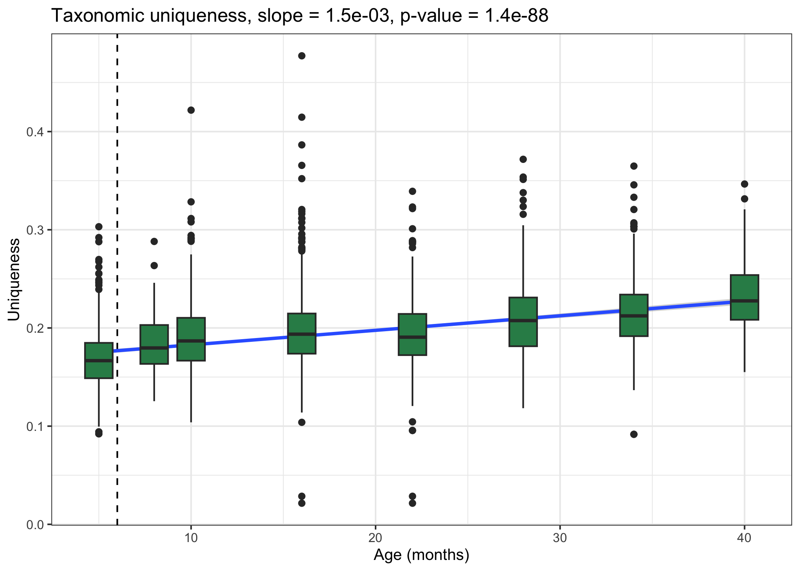
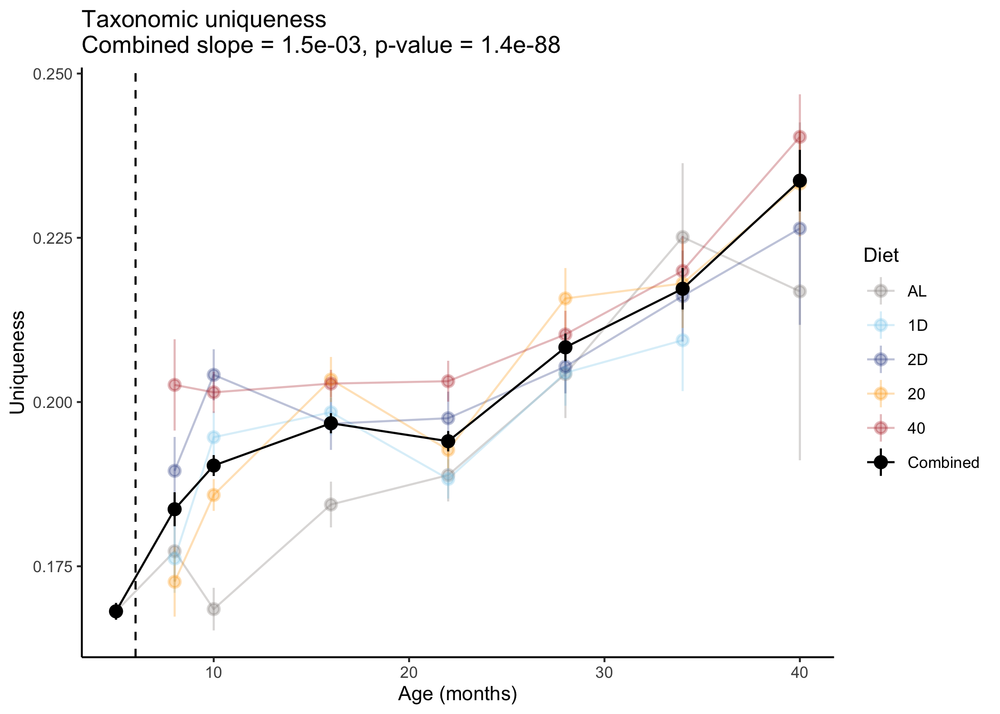

Analysis of taxonomic data from DRiDO microbiome study
================

*Author:* Lev Litichevskiy

*Date:* October 30, 2023

In this tutorial, we import taxonomic classification results and perform
several basic analyses:

1.  ɑ-diversity: influence of age and dietary restriction (DR)
2.  Uniqueness: influence of age and DR
3.  PCoA plot
4.  Examples of microbes affected by age and DR

N.B. This tutorial is derived from `kraken.Rmd`.

# Load libraries

``` r
library(tidyverse)
library(phyloseq)
library(speedyseq) # faster tax_glom
library(ggpubr) # for t-test

diet.palette <- c(AL="seashell4",
                  `1D`="skyblue",
                  `2D`="royalblue4",
                  `20`="orange",
                  `40`="firebrick")
```

# Import Kraken data

This data has been aggregated by `stool.ID`, meaning that we aggregated
samples originating from the same stool sample. We aggregated by summing
Kraken counts.

``` r
agg.kraken.df <- read.table(
  "../data/kraken_matrix_agg_by_stool_ID_n1303x2997.txt", 
  sep="\t", header=T, row.names=1)
dim(agg.kraken.df)
```

    ## [1] 1303 2997

1303 taxons x 2997 stool IDs

``` r
agg.kraken.df[1:5, 1:4]
```

    ##   DO_1D_3001_038w DO_1D_3001_044w DO_1D_3001_069w DO_1D_3001_097w
    ## 3           38776           86250            7128            2690
    ## 4          155093          504990           47311           19201
    ## 5            8648           26016            2200             823
    ## 6          580555         2776515          177216           71408
    ## 7            4511           31300            1138             878

# Import metadata

`stool.meta.df` contains information about each stool sample,
`mouse.meta.df` contains information about the mice.

``` r
stool.meta.df <- read.table(
  "../data/metadata/stool_metadata_after_QC_no_controls_n2997_230620.txt", 
  sep="\t", header=T)
mouse.meta.df <- read.csv("../data/metadata/AnimalData_Processed_20230712.csv")
stool.meta.annot.df <- stool.meta.df %>%
  merge(mouse.meta.df, by.x="mouse.ID", by.y="MouseID")

dim(stool.meta.annot.df)
```

    ## [1] 2997   25

``` r
n_distinct(stool.meta.annot.df$stool.ID)
```

    ## [1] 2997

2997 (unique) stool IDs

What kind of metadata do we have?

``` r
stool.meta.annot.df %>% 
  dplyr::select(stool.ID, mouse.ID, sample.type, age.wks, DOE, SurvDays) %>% 
  head()
```

    ##          stool.ID   mouse.ID sample.type age.wks     DOE SurvDays
    ## 1 DO_1D_3001_038w DO-1D-3001          DO      38 7/23/18      895
    ## 2 DO_1D_3001_044w DO-1D-3001          DO      44 7/23/18      895
    ## 3 DO_1D_3001_069w DO-1D-3001          DO      69 7/23/18      895
    ## 4 DO_1D_3001_097w DO-1D-3001          DO      97 7/23/18      895
    ## 5 DO_1D_3002_038w DO-1D-3002          DO      38 1/23/18      714
    ## 6 DO_1D_3002_044w DO-1D-3002          DO      44 1/23/18      714

There was one stool collection at 5 months (prior to initiation of DR at
6 months, or 25 weeks). We’ll create a metadata field that indicates
that these 5-month samples were all from mice feeding *ad libitum* (AL).

``` r
stool.meta.annot.df <- stool.meta.annot.df %>% 
  mutate(Diet.5mo.as.AL=case_when(
    age.wks < 25 ~ "AL",
    TRUE ~ as.character(Diet)))
```

# Import Kraken taxonomy

``` r
kraken.tax.df <- read.table(
  "../data/kraken_taxonomy_n1303.txt", 
  sep="\t", header=T, quote="", row.names=1)
dim(kraken.tax.df)
```

    ## [1] 1303    6

1303 taxons

``` r
kraken.tax.df[1:5, ]
```

    ##         phylum      class          order          family         genus species
    ## 3 Firmicutes_A                                                                
    ## 4 Firmicutes_A Clostridia                                                     
    ## 5 Firmicutes_A Clostridia Lachnospirales                                      
    ## 6 Firmicutes_A Clostridia Lachnospirales Lachnospiraceae                      
    ## 7 Firmicutes_A Clostridia Lachnospirales Lachnospiraceae Schaedlerella

# Create phyloseq object

We will make our data into a `phyloseq` object because this package has
several useful functions.

``` r
kraken.sample.meta.df <- stool.meta.annot.df %>% column_to_rownames("stool.ID")

agg.physeq <- phyloseq(
  agg.kraken.df %>% as.matrix %>% otu_table(taxa_are_rows=T),
  kraken.sample.meta.df %>% sample_data,
  kraken.tax.df %>% as.matrix %>% tax_table
)
nsamples(agg.physeq)
```

    ## [1] 2997

2997 samples

# Aggregate to genera

``` r
agg.physeq.genus <- agg.physeq %>% tax_glom(taxrank="genus")
```

``` r
ntaxa(agg.physeq)
```

    ## [1] 1303

``` r
ntaxa(agg.physeq.genus)
```

    ## [1] 252

1303 taxa –\> 252 genera

``` r
sum(otu_table(agg.physeq.genus)) / sum(otu_table(agg.physeq))
```

    ## [1] 0.8544933

85% of reads could be assigned to the level of genus

# Compute distances

Bray-Curtis on genus-level relative abundances.

``` r
agg.genus.bc.dist <- agg.physeq.genus %>%
  transform_sample_counts(function(x) x/sum(x)) %>%
  phyloseq::distance(method="bray")
```

# Alpha diversity

We’ll look at two ɑ-diversity metrics: Shannon index and Simpson’s
index. Both of these metrics account for both richness and evenness.

``` r
alpha.div.df.genus <- estimate_richness(
  agg.physeq.genus, 
  measures=c("Shannon", "Simpson")) %>% 
  rownames_to_column("stool.ID") %>% 
  merge(stool.meta.annot.df, by="stool.ID")

alpha.div.long.df.genus <- alpha.div.df.genus %>% 
  pivot_longer(c(Shannon, Simpson), names_to="metric")
```

## Versus age

``` r
alpha.div.long.df.genus %>% 
  
  # omit the few 46 month samples
  dplyr::filter(age.approx.months <= 40) %>% 
  
  ggplot(aes(x=age.approx.months, y=value)) +
  
  # plot line of best fit
  geom_smooth(method="lm") +
  
  geom_boxplot(aes(group=age.approx.months), fill="seagreen") +
  
  # indicate that DR was initiated at 6 months
  geom_vline(xintercept=6, lty=2) +
  
  facet_wrap(~metric, scales="free") +
  labs(title="Alpha diversity versus age", x="Age (months)", y="") +
  theme_bw(base_size=10)
```

    ## `geom_smooth()` using formula = 'y ~ x'

<!-- -->

## Versus diet

``` r
alpha.div.long.df.genus %>% 
  
  # omit the few 46 month samples for consistency with the versus age plot
  dplyr::filter(age.approx.months <= 40) %>% 
  
  # specify diet order
  mutate(Diet.5mo.as.AL=factor(Diet.5mo.as.AL, levels=c("AL", "1D", "2D", "20", "40"))) %>% 
  
  ggplot(aes(x=Diet.5mo.as.AL, y=value, fill=Diet.5mo.as.AL)) +
  geom_boxplot() +
  
  # t-test
  stat_compare_means(method="t.test", label="p.signif", ref.group="AL") +
  
  labs(x="", y="") +
  facet_wrap(~metric, scales="free") +
  scale_fill_manual(values=diet.palette) +
  theme_bw(base_size=10) +
  theme(legend.position="none")
```

<!-- -->

# Uniqueness

Uniqueness is the distance from a microbiome sample to its nearest
neighbor ([Wilmanski
2021](https://www.nature.com/articles/s42255-021-00348-0)).

``` r
agg.genus.bc.dist.mat <- agg.genus.bc.dist %>% as.matrix
diag(agg.genus.bc.dist.mat) <- NA
agg.genus.uniq.bc.df <- data.frame(
  uniqueness=apply(agg.genus.bc.dist.mat, MARGIN=2, FUN=function(x) {min(x, na.rm=T)}),
  stool.ID=sample_names(agg.physeq.genus)) %>%
  merge(stool.meta.annot.df, by="stool.ID")
```

## Versus age

Regress uniqueness versus age to get slope and p-value.

``` r
agg.genus.uniq.bc.lm.summary <- agg.genus.uniq.bc.df %>%
  dplyr::filter(age.approx.months <= 40) %>% # omit few 46 month samples
  lm(uniqueness ~ age.approx.months, data=.) %>% summary

agg.genus.uniq.bc.lm.pval <- agg.genus.uniq.bc.lm.summary$coefficients[
  "age.approx.months", "Pr(>|t|)"]
agg.genus.uniq.bc.lm.beta <- agg.genus.uniq.bc.lm.summary$coefficients[
  "age.approx.months", "Estimate"]
```

``` r
agg.genus.uniq.bc.df %>% 
  
  # omit few 46 month samples
  dplyr::filter(age.approx.months <= 40) %>%
  
  ggplot(aes(x=age.approx.months, y=uniqueness)) +
  
  # indicate that DR was initiated at 6 months
  geom_vline(xintercept=6, lty=2) +
  
  # plot line of best fit
  geom_smooth(method="lm") +
  
  geom_boxplot(aes(group=age.approx.months), fill="seagreen") +
  
  labs(x="Age (months)", y="Uniqueness", 
       title=sprintf("Taxonomic uniqueness, slope = %.1e, p-value = %.1e",
                     agg.genus.uniq.bc.lm.beta, agg.genus.uniq.bc.lm.pval)) +
  theme_bw(base_size=10) +
  theme(legend.position="none")
```

    ## `geom_smooth()` using formula = 'y ~ x'

<!-- -->

## Versus diet

``` r
agg.genus.uniq.bc.df %>% 
  
  # omit the few 46 month samples for consistency with the versus age plot
  dplyr::filter(age.approx.months <= 40) %>% 
  
  # specify diet order
  mutate(Diet.5mo.as.AL=factor(Diet.5mo.as.AL, levels=c("AL", "1D", "2D", "20", "40"))) %>%
  
  ggplot(aes(x=Diet.5mo.as.AL, y=uniqueness, fill=Diet.5mo.as.AL)) +
  geom_boxplot() +
  
  # t-test
  stat_compare_means(method="t.test", label="p.signif", ref.group="AL") +
  labs(x="Dietary group", y="Uniqueness", title="Taxonomic uniqueness") +
  scale_fill_manual(values=diet.palette) +
  theme_bw(base_size=10) +
  theme(legend.position="none")
```

<!-- -->

# PCoA

We’ll make a principal coordinates analysis (PCoA) plot to look for the
overall influence of age and DR in this dataset.

``` r
agg.pcoa.genus.bc <- agg.genus.bc.dist %>% 
  cmdscale(eig=T, k=3)

agg.pcoa.genus.bc.df <- merge(
  data.frame(agg.pcoa.genus.bc$points) %>% setNames(c("PCoA1", "PCoA2", "PCoA3")),
  kraken.sample.meta.df,
  by="row.names") %>% 
  mutate(Diet=factor(Diet, levels=c("AL", "1D", "2D", "20", "40")),
         Diet.5mo.as.AL=factor(Diet.5mo.as.AL, levels=c("AL", "1D", "2D", "20", "40")))
```

``` r
frac.var.explained.by.pcos <- agg.pcoa.genus.bc$eig / sum(agg.pcoa.genus.bc$eig)
frac.var.explained.by.pcos[1:3]
```

    ## [1] 0.34829834 0.08210728 0.07142242

PCoA1 and PCoA2 explain 35% and 8% of overall variance, respectively

``` r
agg.pcoa.genus.bc.df %>% 
  
  # color by diet, size by age
  ggplot(aes(x=PCoA1, y=PCoA2, color=Diet.5mo.as.AL, size=age.approx.months)) +
  
  # slight transparency
  geom_point(alpha=0.8) +
  
  scale_color_manual(values=diet.palette) +
  
  # customize the legend for size
  scale_size_continuous(breaks=c(5,10,16,22,28,34,40,46), range=c(0.25,2)) +
  
  labs(color="Diet", size="Age (months)") +
  theme_bw(base_size=10)
```

<!-- -->

We can sort of see a color gradient (red mostly at the top) and a size
gradient (smaller dots at the bottom)

# Examples of individual genera

## Bifidobacterium versus age

Bifidobacterium is the genus that increases the most with age.

``` r
agg.physeq.genus %>%
  
  # convert to relative abundances
  transform_sample_counts(function(x) x/sum(x)) %>% 
  
  # extract data from phyloseq object
  psmelt %>% 
  
  # take log10
  mutate(log10relab=log10(Abundance)) %>% 
  
  # subset to Bifido
  dplyr::filter(genus == "Bifidobacterium") %>% 
  
  # omit the few 46 month samples
  dplyr::filter(age.approx.months <= 40) %>%
  
  ggplot(aes(x=age.approx.months, y=log10relab)) +
  
  # indicate that DR was initiated at 6 months
  geom_vline(xintercept=6, lty=2) +
  
  geom_smooth(method="lm") +
  geom_boxplot(aes(group=age.approx.months), fill="seagreen") +
  labs(x="Age (months)", y="log10(relab)", title="Bifidobacterium") +
  theme_bw(base_size=10)
```

    ## `geom_smooth()` using formula = 'y ~ x'

<!-- -->

## Ligilactobacillus versus diet

Ligilactobacillus is strongly increased by DR

``` r
agg.physeq.genus %>% 
  
  # convert to relative abundances
  transform_sample_counts(function(x) x/sum(x)) %>% 
  
  # extract data from phyloseq object
  psmelt %>% 
  
  # subset to Bifido
  dplyr::filter(genus == "Ligilactobacillus") %>% 
  
  # omit the few 46 month samples
  dplyr::filter(age.approx.months <= 40) %>%
  
  # specify diet order
  mutate(Diet.5mo.as.AL=factor(Diet.5mo.as.AL, levels=c("AL", "1D", "2D", "20", "40"))) %>% 
  
  # take log10
  mutate(log10relab=log10(Abundance)) %>% 
  
  ggplot(aes(x=Diet.5mo.as.AL, y=log10relab, fill=Diet.5mo.as.AL)) +
  geom_boxplot() +
  
  # t-test
  stat_compare_means(ref.group="AL", label="p.signif", method="t.test") +
  
  labs(x="", y="log10(relab)", title="Ligilactobacillus", fill="Diet") +
  scale_fill_manual(values=diet.palette) +
  theme_bw(base_size=10)
```

<!-- -->

``` r
  theme(legend.position="none")
```

    ## List of 1
    ##  $ legend.position: chr "none"
    ##  - attr(*, "class")= chr [1:2] "theme" "gg"
    ##  - attr(*, "complete")= logi FALSE
    ##  - attr(*, "validate")= logi TRUE

# sessionInfo

``` r
sessionInfo()
```

    ## R version 4.2.2 (2022-10-31)
    ## Platform: x86_64-apple-darwin17.0 (64-bit)
    ## Running under: macOS Big Sur ... 10.16
    ## 
    ## Matrix products: default
    ## BLAS:   /Library/Frameworks/R.framework/Versions/4.2/Resources/lib/libRblas.0.dylib
    ## LAPACK: /Library/Frameworks/R.framework/Versions/4.2/Resources/lib/libRlapack.dylib
    ## 
    ## locale:
    ## [1] en_US.UTF-8/en_US.UTF-8/en_US.UTF-8/C/en_US.UTF-8/en_US.UTF-8
    ## 
    ## attached base packages:
    ## [1] stats     graphics  grDevices utils     datasets  methods   base     
    ## 
    ## other attached packages:
    ##  [1] ggpubr_0.6.0         speedyseq_0.5.3.9018 phyloseq_1.42.0     
    ##  [4] lubridate_1.9.2      forcats_1.0.0        stringr_1.5.0       
    ##  [7] dplyr_1.1.2          purrr_1.0.2          readr_2.1.4         
    ## [10] tidyr_1.3.0          tibble_3.2.1         ggplot2_3.4.2       
    ## [13] tidyverse_2.0.0     
    ## 
    ## loaded via a namespace (and not attached):
    ##  [1] nlme_3.1-163           bitops_1.0-7           GenomeInfoDb_1.34.9   
    ##  [4] tools_4.2.2            backports_1.4.1        utf8_1.2.3            
    ##  [7] R6_2.5.1               vegan_2.6-4            DBI_1.1.3             
    ## [10] BiocGenerics_0.44.0    mgcv_1.9-0             colorspace_2.1-0      
    ## [13] permute_0.9-7          rhdf5filters_1.10.1    ade4_1.7-22           
    ## [16] withr_2.5.0            tidyselect_1.2.0       compiler_4.2.2        
    ## [19] cli_3.6.1              Biobase_2.58.0         labeling_0.4.2        
    ## [22] scales_1.2.1           digest_0.6.33          rmarkdown_2.23        
    ## [25] XVector_0.38.0         pkgconfig_2.0.3        htmltools_0.5.5       
    ## [28] highr_0.10             fastmap_1.1.1          rlang_1.1.1           
    ## [31] rstudioapi_0.15.0      generics_0.1.3         farver_2.1.1          
    ## [34] jsonlite_1.8.7         car_3.1-2              RCurl_1.98-1.12       
    ## [37] magrittr_2.0.3         GenomeInfoDbData_1.2.9 biomformat_1.26.0     
    ## [40] Matrix_1.6-0           Rcpp_1.0.11            munsell_0.5.0         
    ## [43] S4Vectors_0.36.2       Rhdf5lib_1.20.0        fansi_1.0.4           
    ## [46] ape_5.7-1              abind_1.4-5            lifecycle_1.0.3       
    ## [49] stringi_1.7.12         yaml_2.3.7             carData_3.0-5         
    ## [52] MASS_7.3-60            zlibbioc_1.44.0        rhdf5_2.42.1          
    ## [55] plyr_1.8.8             grid_4.2.2             parallel_4.2.2        
    ## [58] crayon_1.5.2           lattice_0.21-8         Biostrings_2.66.0     
    ## [61] splines_4.2.2          multtest_2.54.0        hms_1.1.3             
    ## [64] knitr_1.43             pillar_1.9.0           igraph_1.5.1          
    ## [67] ggsignif_0.6.4         reshape2_1.4.4         codetools_0.2-19      
    ## [70] stats4_4.2.2           glue_1.6.2             evaluate_0.21         
    ## [73] data.table_1.14.8      vctrs_0.6.3            tzdb_0.4.0            
    ## [76] foreach_1.5.2          gtable_0.3.3           xfun_0.40             
    ## [79] broom_1.0.5            rstatix_0.7.2          survival_3.5-5        
    ## [82] iterators_1.0.14       IRanges_2.32.0         cluster_2.1.4         
    ## [85] timechange_0.2.0
